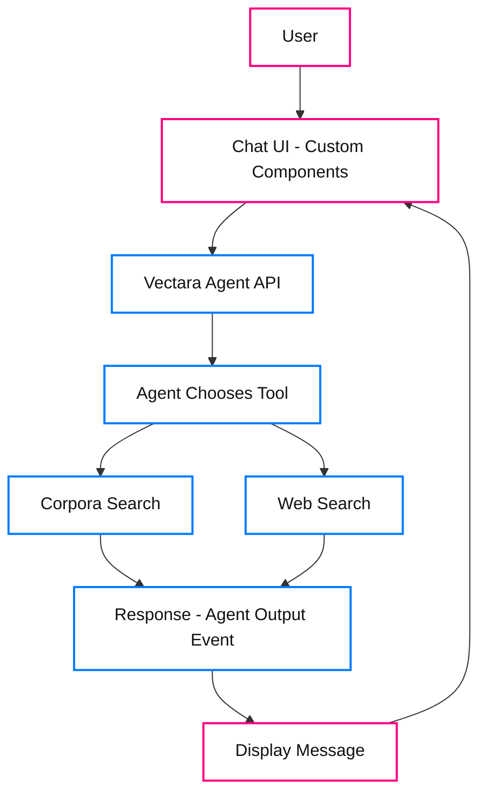

import CodePanel from '@site/src/theme/CodePanel';

Learn how to build a chatbot using our Agent APIs. In this tutorial, you will 
create an onboarding assistant for a manufacturing use case. This chatbot
answers employee questions from uploaded documents that contain
safety protocols and equipment manuals. This example may provide
inspiration for your specific use case.

## What you will build

A single-page web app with a clean chat interface, powered by React for the
frontend and Vectara's Agent APIs for the backend. The agent uses corpora
and web search tools to provide beginner-friendly answers in Markdown format.
The application has the following features:

The chatbot will look like this example:


## Prerequisites

Before starting this tutorial, ensure you have the following:

- **Vectara account**: [Sign up](https://console.vectara.com) and get an API key with
  query and indexing permissions, or use your Personal API key.
- Install the latest releases of Node.js and npm.

This tutorial includes instructions for installing a sample demo app and 
creating a corpus with sample manufacturing data, so no existing data is required.

:::warning
This app tutorial is for demo purposes and not production environments.
:::

## Getting Started

This tutorial uses a pre-built chatbot application. You'll download the app,
set up your corpus with data, create an agent, and start chatting.

### Download and Install

1. **Download and extract** Download the [Sample demo app](https://github.com/vectara/agent-demo-app) and unzip it to your desired location
2. **Install dependencies** - Open terminal in the extracted folder and run:
   ```bash
   npm install
   ```
   This takes 1-2 minutes to download required packages.

**What's included:**
- `src/api.ts` - Vectara API integration (creates sessions, sends messages)
- `src/App.tsx` - Chat interface with settings panel
- `src/main.tsx` - React application entry point
- `src/index.css` - Complete styling

## Chatbot build overview


Follow this process to get your chatbot running.

1. Set up your Vectara corpus with sample data.
2. Create an agent with search tools.
3. Run and test your chatbot.

## Step 1. Set up your corpus with sample data

Create a corpus and populate it with sample manufacturing data. This example
shows you how to create a corpus with the API.

### Create the corpus

<CodePanel
  title="Create corpus"
  snippets={[
    {
      language: 'bash',
      code: `curl -X POST "https://api.vectara.io/v2/corpora" \\
  -H "Authorization: Bearer YOUR_API_KEY" \\
  -H "Content-Type: application/json" \\
  -d '{
    "key": "acme_onboarding",
    "name": "ACME Manufacturing Onboarding",
    "description": "Employee onboarding documents for ACME Manufacturing"
  }'`
    }
  ]}
  layout="stacked"
  collapsible={false}
/>

### Add sample documents

Index sample documents to populate your corpus. Here are example documents you can add:

**Safety protocol document**

<CodePanel
  title="Index safety protocol document"
  snippets={[
    {
      language: 'bash',
      code: `curl -X POST "https://api.vectara.io/v2/corpora/acme_onboarding/documents" \\
  -H "Authorization: Bearer YOUR_API_KEY" \\
  -H "Content-Type: application/json" \\
  -d '{
    "id": "safety_protocol_001",
    "type": "core",
    "metadata": {
      "document_type": "safety_protocol",
      "equipment": "CNC_Machine_X",
      "safety_category": "operation"
    },
    "document_parts": [
      {
        "text": "CNC Machine X Safety Protocols\\n\\n1. Personal Protective Equipment (PPE):\\n- Safety \nglasses must be worn at all times\\n- Steel-toed boots are required in the machine shop\\n- Hearing \nprotection required when machine is operating\\n- No loose clothing or jewelry\\n\\n2. Machine \nOperation:\\n- Never operate the machine without proper training\\n- Always perform pre-operation \nsafety checks\\n- Emergency stop button is located on the front panel\\n- Keep work area clean and free \nof debris\\n\\n3. Maintenance:\\n- Only certified technicians may perform maintenance\\n- Machine must be \npowered off and locked out during maintenance\\n- Report any unusual sounds or vibrations immediately",
        "metadata": {
          "section": "safety"
        }
      }
    ]
  }'`
    }
  ]}
  layout="stacked"
  collapsible={false}
/>

**Equipment manual document**

<CodePanel
  title="Index equipment manual document"
  snippets={[
    {
      language: 'bash',
      code: `curl -X POST "https://api.vectara.io/v2/corpora/acme_onboarding/documents" \\
  -H "Authorization: Bearer YOUR_API_KEY" \\
  -H "Content-Type: application/json" \\
  -d '{
    "id": "equipment_manual_001",
    "type": "core",
    "metadata": {
      "document_type": "equipment_manual",
      "equipment": "CNC_Machine_X",
      "process": "machining"
    },
    "document_parts": [
      {
        "text": "CNC Machine X Operating Manual\\n\\nStartup Procedure:\\n1. Perform visual inspection of \nmachine\\n2. Check coolant levels\\n3. Verify all safety guards are in place\\n4. Power on the main control \npanel\\n5. Run homing sequence\\n6. Load program from control interface\\n\\nDaily Maintenance:\\n- Clean \nmachine bed and surrounding area\\n- Check and refill coolant as needed\\n- Inspect cutting tools \nfor wear\\n- Lubricate moving parts per schedule\\n\\nTroubleshooting:\\n- If machine fails to home: \nCheck limit switches\\n- If spindle won't start: Verify emergency stop is released\\n- For error \ncodes, consult technical manual section 7",
        "metadata": {
          "section": "operation"
        }
      }
    ]
  }'`
    }
  ]}
  layout="stacked"
  collapsible={false}
/>

**Onboarding guide document**

<CodePanel
  title="Index onboarding guide document"
  snippets={[
    {
      language: 'bash',
      code: `curl -X POST "https://api.vectara.io/v2/corpora/acme_onboarding/documents" \\
  -H "Authorization: Bearer YOUR_API_KEY" \\
  -H "Content-Type: application/json" \\
  -d '{
    "id": "onboarding_guide_001",
    "type": "core",
    "metadata": {
      "document_type": "onboarding_guide",
      "process": "general"
    },
    "document_parts": [
      {
        "text": "New Employee Onboarding Guide\\n\\nFirst Week Checklist:\\n1. Complete safety orientation \n(mandatory)\\n2. Receive and review employee handbook\\n3. Get ID badge and access credentials\\n4. Tour \nmanufacturing facility\\n5. Meet your supervisor and team\\n6. Review emergency procedures\\n\\nTraining \nRequirements:\\n- General safety training: 8 hours\\n- Equipment-specific training: 16 hours\\n- Quality \ncontrol procedures: 4 hours\\n- Emergency response: 2 hours\\n\\nImportant Contacts:\\n- Safety Officer: \next. 2100\\n- HR Department: ext. 2200\\n- Facilities: ext. 2300\\n- IT Support: ext. 2400",
        "metadata": {
          "section": "onboarding"
        }
      }
    ]
  }'`
    }
  ]}
  layout="stacked"
  collapsible={false}
/>

After adding these documents, your corpus will be ready for the agent to search.

## Step 2. Create an agent with multiple search tools

Before building the frontend, create an agent that will power your chatbot. This agent
will have access to both your corpus and web search as a backup for questions outside
your corpus. If you want, you can omit the web search tool and only use the
corpora search.

<CodePanel
  title="Create agent with multiple tools"
  snippets={[
    {
      language: 'bash',
      code: `curl -X POST "https://api.vectara.io/v2/agents" \\
  -H "Authorization: Bearer YOUR_API_KEY" \\
  -H "Content-Type: application/json" \\
  -d '{
    "key": "factory-friend",
    "name": "Factory Friend",
    "description": "Manufacturing knowledge assistant for new employees",
    "tool_configurations": {
      "search_onboarding": {
        "type": "corpora_search",
        "description_template": "Search the ACME Manufacturing onboarding documents for company-specific \ninformation about safety protocols, equipment operation, and factory policies.",
        "query_configuration": {
          "search": {
            "corpora": [
              {
                "corpus_key": "acme_onboarding",
                "lexical_interpolation": 0.01
              }
            ],
            "limit": 10,
            "context_configuration": {
              "sentences_before": 2,
              "sentences_after": 2
            },
            "reranker": {
              "type": "customer_reranker",
              "reranker_id": "rnk_272725719"
            }
          }
        }
      },
      "web_search": {
        "type": "web_search",
        "description_template": "Search the web for general manufacturing information, industry standards, or topics not covered in the company documents. Use this when the corpus search does not have relevant information."
      }
    },
    "first_step": {
      "type": "conversational",
      "instructions": [
        {
          "type": "inline",
          "name": "Factory Assistant Instructions",
          "template": "You are Factory Friend, a helpful assistant for manufacturing employees at ACME Manufacturing.\\n\\nIMPORTANT - Tool Usage:\\n- ALWAYS try the search_onboarding tool FIRST for questions about ACME-specific safety protocols, equipment, procedures, and policies\\n- Only use web_search if the corpus search returns no relevant results or for general manufacturing questions not specific to ACME\\n- When using information from the corpus, ALWAYS cite the source\\n- When using web search results, indicate that the information is from external sources\\n\\nResponse Style:\\n- Be clear, concise, and beginner-friendly\\n- Use numbered lists when appropriate\\n- Prioritize safety information\\n- If you are unsure or the information is not available, say so clearly"
        }
      ],
      "output_parser": {
        "type": "default"
      }
    },
    "model": {
      "name": "gpt-4o",
      "parameters": {
        "temperature": 0.3,
        "max_tokens": 1000
      }
    }
  }'`
    }
  ]}
  layout="stacked"
  collapsible={false}
/>

This creates an agent with:
- **Corpora search tool**: Searches your `acme_onboarding` corpus for
  company-specific information.
- **Web search tool**: Falls back to web search for general questions, or
  when the corpus lacks information.
- **Smart instructions**: The agent knows to try internal documents first,
  then web search as backup.
- **Conversational step**: Responds naturally to user input with proper
  tool selection.

The agent chooses the appropriate tool automatically based on the
question. For example:
- "What are the safety protocols for CNC Machine X?" - Uses corpus search
- "What is Six Sigma?" - May use web search if not in your corpus
- "How do I get my ID badge?" - Uses corpus search

Save the `agent_key` (in this example: `factory-friend`) for use in your
application.

## Step 3. Run and test your chatbot

Start the development server:

<CodePanel
  title="Start development server"
  snippets={[
    {
      language: 'bash',
      code: `npm run dev`
    }
  ]}
  layout="stacked"
  collapsible={false}
/>

### Test your chatbot

To verify your chatbot works:

1. Open the app in your browser (for example: `http://localhost:5173` after running
   `npm run dev`).
2. Enter your Vectara API key when prompted.
3. Try these sample questions:
   **Questions that should use corpus search:**
   - "What are the safety protocols for operating CNC Machine X?"
   - "How do I maintain the equipment?"
   - "What is the onboarding process for new employees?"
   - "What PPE do I need in the machine shop?"
   **Questions that will probably use web search (data not in corpus):**
   - "What is Six Sigma methodology?"
   - "What are the latest ISO manufacturing standards?"
   - "Who invented the assembly line?"
4. Check that responses include Markdown formatting (numbered lists, citations).
5. Verify the agent correctly chooses which tool to use based on the question.
6. Test the conversation history - sessions maintain context across messages automatically.

You can upload your own data and test the agent responses, and use other
[agent tools](/docs/agent-os/agent-tools).
